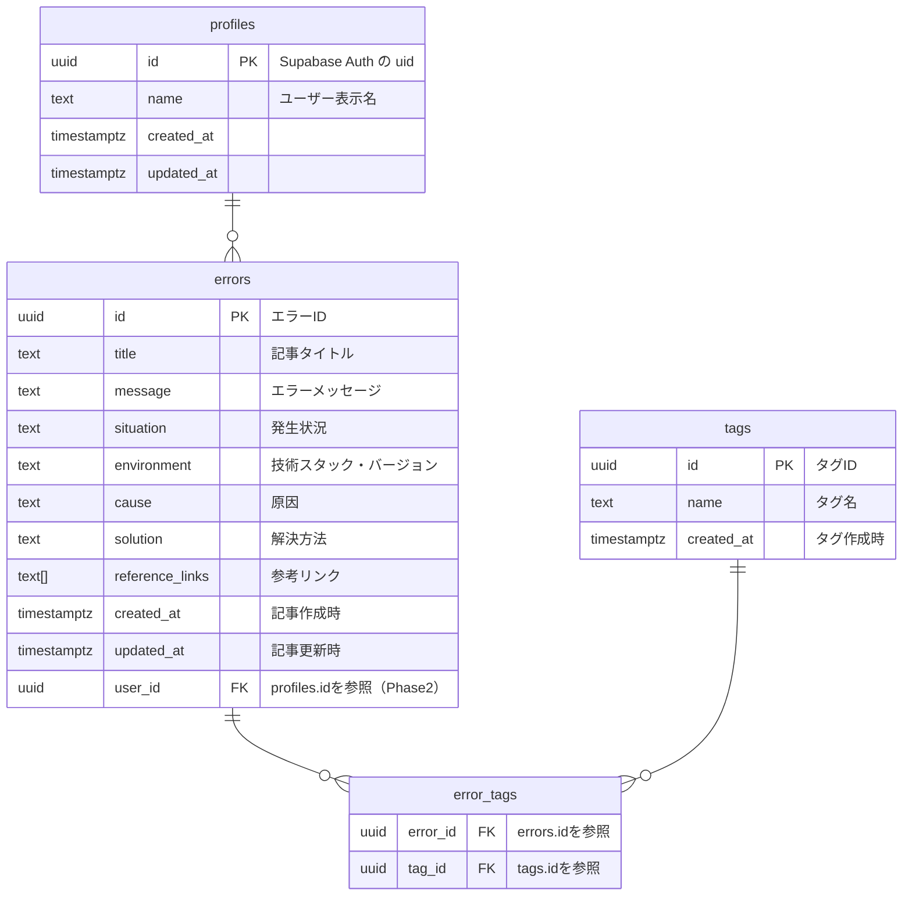

# データベース設計書

## 1. ER 図

## 2. 主要テーブル

### errors テーブル(エラー情報)

| カラム名         | 主キー | データ型    | デフォルト        | NOT NULL | Is Unique | 説明                                  |
| ---------------- | ------ | ----------- | ----------------- | -------- | --------- | ------------------------------------- |
| エラー ID        | PK     | uuid        | gen_random_uuid() | yes      | yes       | エラー ID                             |
| タイトル         |        | text        |                   | yes      | no        | 記事タイトル                          |
| エラーメッセージ |        | text        |                   | yes      | no        | エラー内容                            |
| 発生状況         |        | text        |                   | no       | no        | どの操作・タイミングで起きたか        |
| 環境             |        | text        |                   | no       | no        | 技術スタック・バージョン              |
| 原因             |        | text        |                   | yes      | no        | 原因                                  |
| 解決方法         |        | text        |                   | yes      | no        | 解決方法                              |
| 参考リンク       |        | text[]      |                   | no       | no        | 参考リンク Define as Array にチェック |
| 登録日           |        | timestamptz | now()             | yes      | no        | 記事作成時                            |
| 更新日           |        | timestamptz | now()             | yes      | no        | **記事自動更新トリガーを使用**        |
| ユーザー ID      | FK     | uuid        |                   | yes      | no        | **Phase2 で実装**                     |

#### 実装時 errors テーブルの英語カラム名

- エラー ID → id
- タイトル → title
- エラーメッセージ → message
- 発生状況 → situation
- 環境 → environment
- 原因 → cause
- 解決方法 → solution
- 参考リンク → reference_links
- 登録日 → created_at
- 更新日 → updated_at
- ユーザー ID → user_id

### tags テーブル(タグ情報)

| カラム名 | 主キー | データ型    | デフォルト        | NOT NULL | Is Unique | 説明       |
| -------- | ------ | ----------- | ----------------- | -------- | --------- | ---------- |
| タグ ID  | PK     | uuid        | gen_random_uuid() | yes      | yes       | タグ ID    |
| タグ名   |        | text        |                   | yes      | yes       | タグ表示名 |
| 登録日   |        | timestamptz | now()             | yes      | no        | タグ作成時 |

#### 実装時 tags テーブルの英語カラム名

- タグ ID → id
- タグ名 → name

### error_tags テーブル(エラーとタグの中間テーブル)

| カラム名  | 主キー | データ型 | デフォルト | NOT NULL | Is Unique | 説明       |
| --------- | ------ | -------- | ---------- | -------- | --------- | ---------- |
| エラー ID | PK FK  | uuid     |            | yes      | no        | タグ表示名 |
| タグ ID   | PK FK  | uuid     |            | yes      | no        | タグ作成時 |

#### 実装時 error_tags テーブルの英語カラム名

- エラー ID → error_id
- タグ ID → tag_id

### profiles テーブル(ユーザー情報) \*Phase2 で実装

| カラム名    | 主キー | データ型    | デフォルト | NOT NULL | Is Unique | 説明                               |
| ----------- | ------ | ----------- | ---------- | -------- | --------- | ---------------------------------- |
| ユーザー ID | PK     | uuid        | auth.uid() | yes      | yes       | Supabase Auth の uid               |
| ユーザー名  |        | text        |            | yes      | yes       | ユーザー表示名                     |
| 登録日      |        | timestamptz | now()      | yes      | no        | ユーザー作成時                     |
| 更新日      |        | timestamptz | now()      | yes      | no        | **ユーザー自動更新トリガーを使用** |

#### 実装時 profiles テーブルの英語カラム名

- ユーザー ID → id
- ユーザー名 → name
