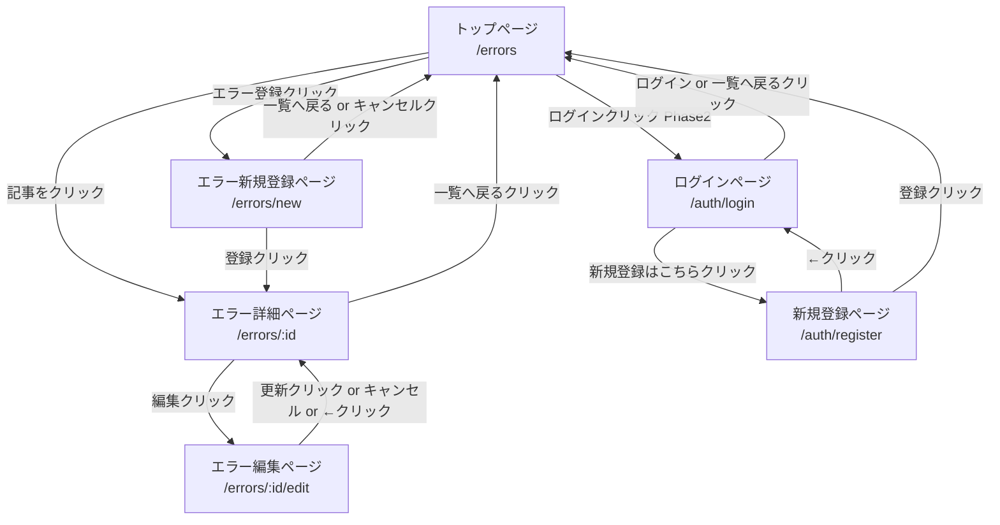

# 画面遷移図

```mermaid
flowchart TD
  %% ===MVP===
  %% トップページ
  A["トップページ<br>/errors"] -->|記事をクリック| B["エラー詳細ページ<br>/errors/:id"]
  A -->|エラー登録クリック| C["エラー新規登録ページ<br>/errors/new"]
  A -->|ログインクリック Phase2| L["ログインページ<br>/auth/login"]

  %% 記事詳細ページ
  B -->|編集クリック| D["エラー編集ページ<br>/errors/:id/edit"]
  B -->|一覧へ戻るクリック| A

  %% 記事登録ページ
  C -->|登録クリック| B
  C -->|一覧へ戻る or キャンセルクリック| A

  %% 記事編集ーページ
  D -->|更新クリック or キャンセル or ←クリック| B

  %% ===Phase2===
  %% ログインページ(Phase2)
  L -->|ログイン or 一覧へ戻るクリック| A
  L -->|新規登録はこちらクリック| R["新規登録ページ<br>/auth/register"]

  %% アカウント登録ページ(Phase2)
  R -->|←クリック| L
  R -->|登録クリック| A
```
